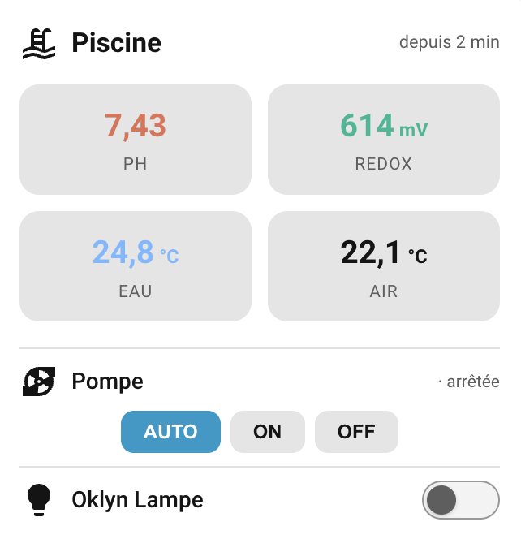

<p align="center">
  
</p>

# Oklyn for Home Assistant

[](https://github.com/ADNPolymerase/ha-oklyn)
[](https://github.com/ADNPolymerase/ha-oklyn/releases)
[](https://github.com/ADNPolymerase/ha-oklyn/actions/workflows/hassfest.yml)
[](https://www.home-assistant.io/)
[](https://github.com/ADNPolymerase/ha-oklyn/blob/main/LICENSE)
[](https://buymeacoffee.com/adnpolymerase)

<a href="https://buymeacoffee.com/adnpolymerase" target="_blank"></a>
<a href="https://adnpolymerase.github.io/HA/" target="_blank"></a>

Custom integration for the **Oklyn** pool controller, published via HACS.

> 🇫🇷 [Lire en français](README.fr.md)

> 🎴 **Companion card available:** [Oklyn Card](https://github.com/ADNPolymerase/oklyn-card) — a dedicated Lovelace card with pH/RedOx thresholds, pump control, auxiliaries and pH calibration. No dependency, full visual editor.
> [](https://my.home-assistant.io/redirect/hacs_repository/?owner=ADNPolymerase&repository=oklyn-card&category=plugin)

---

## Features

- **pH** sensor
- **ORP / RedOx** sensor (mV)
- **Water temperature** sensor (°C)
- **Air temperature** sensor (°C)
- **Salt** sensor in g/L (Salt model)
- **Pump mode** select: `auto` / `on` / `off`
- **Pump running** binary sensor: real electrical state of the pump, independent from the commanded mode (device class `running`)
- **Sensor status attribute**: Oklyn alert level (`normal` / `low` / `high`) exposed on pH, RedOx, temperature and salt sensors — used by [Oklyn Card](https://github.com/ADNPolymerase/oklyn-card) for color coding
- **Auxiliary 1** switch
- **Auxiliary 2** switch
- Full UI configuration — no YAML required
- Cloud polling via `https://api.oklyn.fr/public/v1/`
- Re-authentication flow when token expires
- Diagnostics support (token never exposed)
- French and English translations

---

## Installation via HACS

1. In Home Assistant, open **HACS → Integrations**.
2. Click the **⋮** menu → **Custom repositories**.
3. Add `https://github.com/ADNPolymerase/ha-oklyn` with category **Integration**.
4. Search for **Oklyn** and click **Download**.
5. Restart Home Assistant.
6. Go to **Settings → Devices & Services → Add Integration** and search for **Oklyn**.

---

## Manual installation

1. Download or clone this repository.
2. Copy the `custom_components/oklyn/` folder into your Home Assistant
   `config/custom_components/` directory.
3. Restart Home Assistant.
4. Go to **Settings → Devices & Services → Add Integration** and search for **Oklyn**.

---

## Configuration

During setup you will be asked for:

| Field | Required | Default | Description |
|---|---|---|---|
| Device name | No | Oklyn | Friendly name shown in HA |
| API token | Yes | — | Your `X-Api-Token` from the Oklyn app |

The device ID is always `my` — you do not need to enter it.

### How to get your API token

Access to the API is secured by a private key managed in the Oklyn app:
**Oklyn → My Account → API Key**

---

## Options

After setup, go to **Settings → Devices & Services → Oklyn → Configure** to adjust:

| Option | Default | Description |
|---|---|---|
| Oklyn model | Filtration + Analysis | Your controller model — determines which sensors are created (see below) |
| Polling interval | 60 s | How often the API is queried (30 / 60 / 120 / 300 s) |
| Enable Auxiliary 1 | Yes | Create the Aux 1 switch entity |
| Enable Auxiliary 2 | Yes | Create the Aux 2 switch entity |
| Auxiliary 1 name | Auxiliaire 1 | Custom name for the Aux 1 switch |
| Auxiliary 2 name | Auxiliaire 2 | Custom name for the Aux 2 switch |

The three Oklyn models match the [official lineup](https://www.oklyn.fr/assistant-piscine-connecte/):

| Model | Sensors created |
|---|---|
| Filtration | Temperatures, pump, auxiliaries |
| Filtration + Analysis | + pH, RedOx |
| Filtration + Analysis + Salt | + Salt (g/L) |

Changes take effect immediately (integration reloads automatically).

---

## Entities

| Entity | Type | Description |
|---|---|---|
| `sensor.oklyn_ph` | Sensor | pH value (Analysis models) — `status` attribute: `normal` / `low` / `high` |
| `sensor.oklyn_redox` | Sensor | ORP / RedOx in mV (Analysis models) — `status` attribute |
| `sensor.oklyn_water_temperature` | Sensor | Water temperature in °C — `status` attribute |
| `sensor.oklyn_air_temperature` | Sensor | Air temperature in °C |
| `sensor.oklyn_salt` | Sensor | Salt level in g/L (Salt model only) — `status` attribute |
| `binary_sensor.oklyn_pump_running` | Binary sensor | Real pump running state (device class `running`) |
| `select.oklyn_pump_mode` | Select | Pump command: auto / on / off |
| `switch.oklyn_auxiliaire_1` | Switch | Auxiliary output 1 |
| `switch.oklyn_auxiliaire_2` | Switch | Auxiliary output 2 |

---

## Screenshot



---

## Example dashboard

### Oklyn Card (recommended)

A dedicated Lovelace card is available — pH/RedOx with thresholds, temperatures,
pump control, auxiliaries (switch or regulator), pH calibration offset.
No dependency, full visual editor.

[](https://my.home-assistant.io/redirect/hacs_repository/?owner=ADNPolymerase&repository=oklyn-card&category=plugin)
→ [ADNPolymerase/oklyn-card](https://github.com/ADNPolymerase/oklyn-card)

### YAML examples

Two ready-to-use examples are provided:

- [`examples/dashboard.yaml`](examples/dashboard.yaml) — **native cards only** (no HACS
  frontend dependency): water quality gauges (pH / RedOx), temperature tiles with 24h
  history, pump mode selector and auxiliary switches.
- [`examples/dashboard-bubble.yaml`](examples/dashboard-bubble.yaml) — nicer look, but
  **requires two HACS frontend plugins** (one-click install):
  - Bubble Card: [](https://my.home-assistant.io/redirect/hacs_repository/?owner=Clooos&repository=Bubble-Card&category=plugin)
  - Pool Monitor Card: [](https://my.home-assistant.io/redirect/hacs_repository/?owner=wilsto&repository=pool-monitor-card&category=plugin)

  Pump mode buttons, auxiliary 1/2 controls (each in its own optional block), and a
  full water quality panel.

To use them: **Dashboard → ✏️ Edit → ⋮ → Raw configuration editor**, then paste the
cards. Adjust entity IDs if you renamed your entities (note: default entity IDs
depend on your Home Assistant language).

---

## Important behavior

### Pump

The pump entity reflects the **command** sent to the Oklyn API, not necessarily the
real electrical state.

- `pump` (API field) = command: `auto`, `on`, or `off`
- `status` (API field) = actual real-time state: `on` or `off`

In **auto** mode, the Oklyn controller manages the pump schedule internally.
`status` can be `on` or `off` while `command` is `auto` — this is **normal**.

The `select.oklyn_pump_mode` entity:
- Shows `current_option` = `pump` (the command)
- Exposes `status`, `running`, and `in_transition` as attributes
- `in_transition` is `true` only when `command` is `on` or `off` and differs from `status`
  (never when `command = auto`)

### Auxiliaries

- `aux` (API field) = command sent: `on` or `off`
- `status` (API field) = actual real-time state: `on` or `off`

The switch `is_on` state reflects **status** (real state), not the command.
A brief discrepancy between command and status is normal and exposed as `in_transition`.

### After a command

After sending a command (pump or aux), the integration immediately refreshes data,
then schedules a second refresh ~6 seconds later to capture the real state transition.

---

## Troubleshooting

### Invalid auth

Your API token has been rejected. Go to **Settings → Devices & Services → Oklyn → ⋮ →
Re-authenticate** to enter a new token.

### Cannot connect

The Oklyn API is unreachable. Check your internet connection and the Oklyn service status.

### Auxiliary 2 unavailable

Some Oklyn models do not have a second auxiliary output. If `aux2` returns a 404,
the entity is automatically marked unavailable. You can disable it in Options.

### Entities stuck on "Unavailable"

Check **Settings → System → Logs** and filter on `oklyn` for details.
Enable debug logging by adding to your `configuration.yaml`:

```yaml
logger:
  logs:
    custom_components.oklyn: debug
```

---

## Privacy

The API token is stored encrypted in the Home Assistant config entry storage.
It is **never** logged, never exposed in entity attributes, and never included
in diagnostics exports (it appears as `**REDACTED**`).

---

## Known limitations

- Single device only — the Oklyn API uses `/device/my` with no multi-device support.
- Cloud polling — no local API or push notifications.
- Aux 2 may not be available on all Oklyn hardware revisions.
- Timestamps from the API have no timezone info; they are stored as-is and also
  parsed as naive datetimes.

---

## Contributing

Issues and pull requests welcome at <https://github.com/ADNPolymerase/ha-oklyn/issues>.
